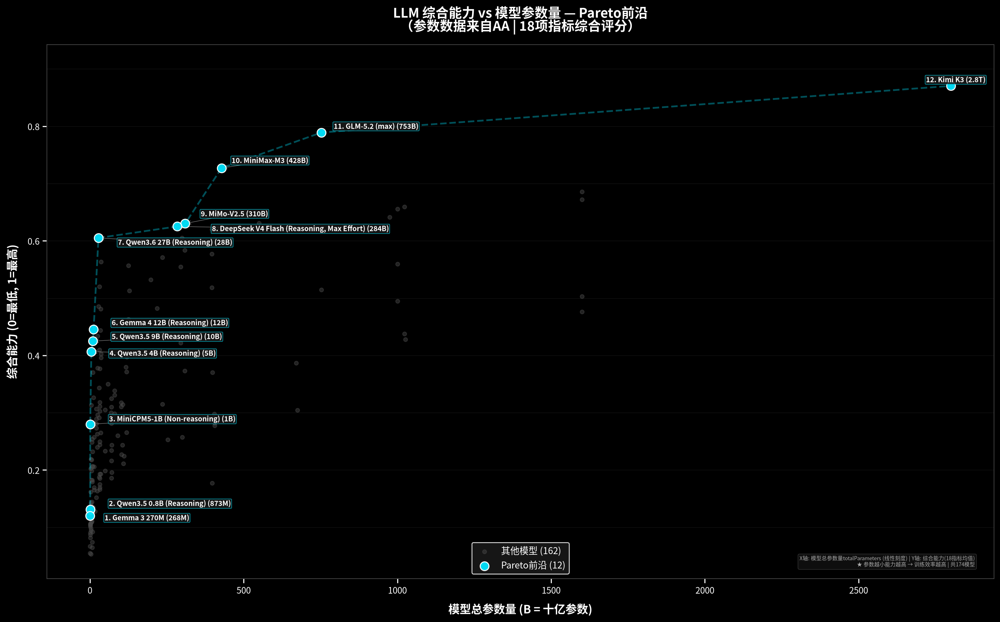

# LLM Leaderboard — 综合能力 vs 模型参数量

## Pareto 前沿模型（综合能力从高到低）

| # | 模型 | 综合能力 | 总参数量 | 活跃参数量 | 大小类 | 开源 | 推理 |
|---|------|---------|---------|-----------|--------|------|------|
| 1 | Kimi K3 | 0.8705 | 2800B | 2800B | large | N | N |
| 2 | GLM-5.2 (max) | 0.7891 | 753B | 40B | large | Y | N |
| 3 | MiniMax-M3 | 0.7270 | 428B | 23B | large | Y | N |
| 4 | MiMo-V2.5 | 0.6303 | 310B | 15B | large | Y | N |
| 5 | DeepSeek V4 Flash (Reasoning, Max Effort) | 0.6252 | 284B | 13B | large | Y | N |
| 6 | Qwen3.6 27B (Reasoning) | 0.6051 | 28B | 28B | small | Y | N |
| 7 | Gemma 4 12B (Reasoning) | 0.4454 | 12B | 12B | small | Y | N |
| 8 | Qwen3.5 9B (Reasoning) | 0.4249 | 10B | 10B | small | Y | N |
| 9 | Qwen3.5 4B (Reasoning) | 0.4066 | 5B | 5B | small | Y | N |
| 10 | MiniCPM5-1B (Non-reasoning) | 0.2799 | 1B | 1B | tiny | Y | N |
| 11 | Qwen3.5 0.8B (Reasoning) | 0.1311 | 873M | 873M | tiny | Y | N |
| 12 | Gemma 3 270M | 0.1202 | 268M | 268M | tiny | Y | N |

### 评分方法

1. **18项评估指标**各自线性归一化到 [0,1]
2. **综合能力值** = 所有有效归一化分数的算术平均
3. **Pareto前沿** = 不被任何其他模型支配的模型（参数更少且能力更高）

### 横轴说明

**X轴 = 模型总参数量 (totalParameters)**

参数数据来自 Artificial Analysis 的模型元数据 (`totalParameters`)，
即模型的总参数量（单位：十亿/B）。对于 MoE 模型，总参数量包含所有专家参数。
线性刻度展示，按实际参数量1:1排布。

Pareto 前沿上的模型代表了**最高训练效率**——用更少的参数实现更高的能力。

### 数据来源

**数据来源**: [Artificial Analysis](https://artificialanalysis.ai/leaderboards/models)  
**方法论**: [AA Methodology](https://artificialanalysis.ai/methodology)  
**模型总数**: 247  