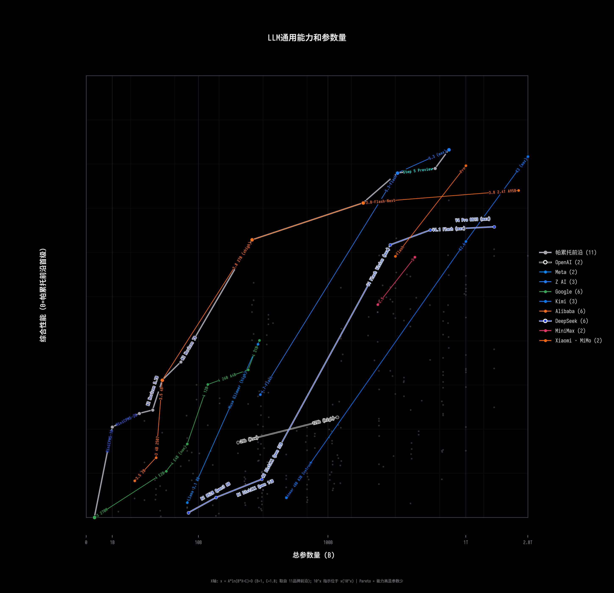

# LLM Leaderboard — 综合能力 vs 模型参数量



## 参数模型（综合能力从高到低）

共收录 **Status: All**（含已弃用）有参数量数据的模型；按重新归一化后的综合能力排序。「帕累托」项：✅ = 总体帕累托前沿模型，❌ = 被支配。图表纵轴以总体帕累托前沿第一级（y0 = 0.1243，即前沿左端点 Gemma 3 270M）为 0：综合能力 ≥ 该级的有参数量数据模型 288 个入图，52 个能力低于第一级的不出现在图中；总参数量高于品牌前沿最大值的模型同样不入图（缺少参数量数据的模型不在图表和表格中）。

| # | 模型 | 综合能力 | 总参数量 | 活跃参数量 | 大小类 | 开源 | 推理 |
|---|------|---------|---------|-----------|--------|------|------|
| 1 | GLM-5.3 (max) | 0.8518 | 753B | 40B | large | ✅ | ✅ |
| 2 | Kimi K3 (max) | 0.8388 | 2.8T | 104B | large | ✅ | ✅ |
| 3 | MiMo-V2.6-Pro | 0.8201 | 1T | 42B | large | ✅ | ✅ |
| 4 | Step 5 Preview | 0.8163 | 600B | — | large | ❌ | ✅ |
| 5 | GLM-5.3-Flash | 0.8060 | 320B | 18B | large | ✅ | ✅ |
| 6 | Qwen3.8 2.4T A95B | 0.7724 | 2.4T | 95B | large | ✅ | ✅ |
| 7 | GLM-5.2 (max) | 0.7529 | 753B | 40B | large | ✅ | ✅ |
| 8 | Qwen3.8-Flash-Next | 0.7479 | 180B | 6B | large | ✅ | ✅ |
| 9 | Ling 3.1 Flash | 0.7245 | 560B | — | large | ❌ | ✅ |
| 10 | DeepSeek V4 Pro 0813 (max) | 0.7002 | 1.6T | 49B | large | ✅ | ✅ |
| 11 | DeepSeek V4.1 Flash (max) | 0.6927 | 552B | 16B | large | ✅ | ✅ |
| 12 | Motif 3 | 0.6771 | 314B | 13.2B | large | ✅ | ✅ |
| 13 | Qwen3.8 27B (xhigh) | 0.6737 | 27B | — | small | ✅ | ✅ |
| 14 | Kimi K2.6 | 0.6717 | 1T | 32B | large | ✅ | ✅ |
| 15 | Mistral Large 4 Preview | 0.6647 | 1T | — | large | ❌ | ✅ |
| 16 | DeepSeek V4 Flash Vision (max) | 0.6644 | 284B | — | large | ❌ | ✅ |
| 17 | DeepSeek V4 Flash 0731 (max) | 0.6644 | 284B | 13B | large | ✅ | ✅ |
| 18 | DeepSeek V4 Pro (high) | 0.6558 | 1.6T | 49B | large | ✅ | ✅ |
| 19 | GLM-5 | 0.6439 | 744B | 40B | large | ✅ | ✅ |
| 20 | JT-4.1 Flash 236B A21B | 0.6434 | 236B | — | large | ❌ | ✅ |
| 21 | Kimi K3 (low) | 0.6428 | 2.8T | 104B | large | ✅ | ✅ |
| 22 | DeepSeek V4 Pro (max) | 0.6426 | 1.6T | 49B | large | ✅ | ✅ |
| 23 | MiMo-V2.6-Flash | 0.6415 | 309B | 15B | large | ✅ | ✅ |
| 24 | MiniMax-M3 | 0.6396 | 428B | 23B | large | ✅ | ✅ |
| 25 | GLM-5.1 | 0.6209 | 744B | 40B | large | ✅ | ✅ |
| 26 | Motif 3 (Beta) | 0.6106 | 314B | — | large | ❌ | ✅ |
| 27 | K2 Horizon 375B A23B | 0.6059 | 375B | 23B | large | ✅ | ✅ |
| 28 | GLM-5.3 (low) | 0.6052 | 753B | 40B | large | ✅ | ✅ |
| 29 | Kimi K2.7 Code | 0.6034 | 1T | 32B | large | ✅ | ✅ |
| 30 | Nex-N2-Pro | 0.6021 | 397B | 17B | large | ✅ | ✅ |
| 31 | Qwen3.5 27B | 0.5893 | 27.8B | — | small | ✅ | ✅ |
| 32 | MiMo-V2-Flash (Feb 2026) | 0.5890 | 309B | 15B | large | ✅ | ✅ |
| 33 | MiMo-V2.5-Pro | 0.5858 | 1T | 42B | large | ✅ | ✅ |
| 34 | Solar Open2 250B | 0.5842 | 250B | 15B | large | ✅ | ✅ |
| 35 | DeepSeek V4 Flash (max) | 0.5811 | 284B | 13B | large | ✅ | ✅ |
| 36 | Ling-3.0-flash-VL | 0.5798 | 124B | 5.5B | medium | ✅ | ✅ |
| 37 | MiMo-V2.5 | 0.5791 | 310B | 15B | large | ✅ | ✅ |
| 38 | Kimi K2.5 | 0.5784 | 1T | 32B | large | ✅ | ✅ |
| 39 | Kimi K2 Thinking | 0.5722 | 1T | 32B | large | ✅ | ✅ |
| 40 | Inkling (xhigh) | 0.5668 | 975B | 41B | large | ✅ | ✅ |
| 41 | Kimi K2.6 (non-reasoning) | 0.5651 | 1T | 32B | large | ✅ | ❌ |
| 42 | Inkling Small | 0.5610 | 266B | 12B | large | ✅ | ✅ |
| 43 | Quasar 438B (max) | 0.5605 | 438B | — | large | ❌ | ✅ |
| 44 | DeepSeek V4 Flash (high) | 0.5567 | 284B | 13B | large | ✅ | ✅ |
| 45 | Qwen3.6 27B | 0.5551 | 27.8B | — | small | ✅ | ✅ |
| 46 | JT-4.1 Flash 236B A21B (non-reasoning) | 0.5550 | 236B | — | large | ❌ | ❌ |
| 47 | Hy3-preview | 0.5517 | 295B | 21B | large | ✅ | ✅ |
| 48 | MiniMax-M2.5 | 0.5463 | 230B | 10B | large | ✅ | ✅ |
| 49 | Qwen3.8 27B (medium) | 0.5458 | 27B | — | small | ✅ | ✅ |
| 50 | Nemotron 3 Ultra | 0.5454 | 550B | 55B | large | ✅ | ✅ |
| 51 | GLM-5.1 (non-reasoning) | 0.5452 | 744B | 40B | large | ✅ | ❌ |
| 52 | Qwen3.5 397B A17B | 0.5378 | 397B | 17B | large | ✅ | ✅ |
| 53 | Qwen3.8 27B (low) | 0.5319 | 27B | — | small | ✅ | ✅ |
| 54 | MiniMax-M2.7 | 0.5312 | 230B | 10B | large | ✅ | ✅ |
| 55 | MiniMax-M2.1 | 0.5312 | 230B | 10B | large | ✅ | ✅ |
| 56 | Hy3 | 0.5288 | 299B | 21B | large | ✅ | ✅ |
| 57 | Qwen3.5 35B A3B | 0.5258 | 36B | 3B | small | ✅ | ✅ |
| 58 | Step 3.7 Flash | 0.5220 | 198B | 11B | large | ✅ | ✅ |
| 59 | Kimi K2.5 (non-reasoning) | 0.5205 | 1T | 32B | large | ✅ | ❌ |
| 60 | MiMo-V2-Flash | 0.5193 | 309B | 15B | large | ✅ | ✅ |
| 61 | K2 Horizon MoVA 36B A4B | 0.5174 | 36B | 4B | small | ✅ | ✅ |
| 62 | GLM-4.7 | 0.5149 | 357B | 32B | large | ✅ | ✅ |
| 63 | DeepSeek V3.2 | 0.5142 | 685B | 37B | large | ✅ | ✅ |
| 64 | GLM-5 (non-reasoning) | 0.5093 | 744B | 40B | large | ✅ | ❌ |
| 65 | Qwen3.6 35B A3B | 0.5075 | 36B | 3B | small | ✅ | ✅ |
| 66 | G9v3-39A5B | 0.5065 | 39B | 5B | small | ✅ | ✅ |
| 67 | Qwen3.5 397B A17B (non-reasoning) | 0.5026 | 397B | 17B | large | ✅ | ❌ |
| 68 | Qwen3.5 122B A10B | 0.4988 | 125B | 10B | medium | ✅ | ✅ |
| 69 | Qwen3.5 27B (non-reasoning) | 0.4878 | 27.8B | — | small | ✅ | ❌ |
| 70 | A.X-K2 | 0.4872 | 692B | 33B | large | ✅ | ✅ |
| 71 | DeepSeek V3.2 Speciale | 0.4866 | 685B | 37B | large | ✅ | ✅ |
| 72 | JT-35B-Flash | 0.4856 | 35B | — | small | ❌ | ❌ |
| 73 | Step 3.5 Flash | 0.4848 | 196B | 11B | large | ✅ | ✅ |
| 74 | Ling-3.0-flash-Fin | 0.4830 | 124B | 5.1B | medium | ✅ | ✅ |
| 75 | K-EXAONE 2.0 | 0.4818 | 750B | 37B | large | ✅ | ✅ |
| 76 | Ling 3.0 Flash | 0.4786 | 124B | 5.1B | medium | ✅ | ✅ |
| 77 | Qwen3.8 27B (non-reasoning) | 0.4763 | 27B | — | small | ✅ | ❌ |
| 78 | Gemma 4 31B | 0.4757 | 30.7B | — | small | ✅ | ✅ |
| 79 | MiniMax-M2 | 0.4722 | 230B | 10B | large | ✅ | ✅ |
| 80 | Muse Glimmer (high) | 0.4682 | 30B | — | small | ✅ | ✅ |
| 81 | Solar Mini 4 | 0.4678 | 35B | — | small | ❌ | ✅ |
| 82 | GLM-5.2 (non-reasoning) | 0.4606 | 753B | 40B | large | ✅ | ❌ |
| 83 | DeepSeek V4 Pro (non-reasoning) | 0.4574 | 1.6T | 49B | large | ✅ | ❌ |
| 84 | Qwen3.6 27B (non-reasoning) | 0.4551 | 27.8B | — | small | ✅ | ❌ |
| 85 | Mistral Medium 3.5 | 0.4480 | 128B | — | medium | ✅ | ✅ |
| 86 | Ring-2.6-1T | 0.4468 | 1T | 63B | large | ✅ | ✅ |
| 87 | DeepSeek V3.2 Exp | 0.4405 | 685B | 37B | large | ✅ | ✅ |
| 88 | DeepSeek V4.1 Flash (non-reasoning) | 0.4366 | 552B | 16B | large | ✅ | ❌ |
| 89 | Command A+ | 0.4363 | 218B | 25B | large | ✅ | ✅ |
| 90 | Qwen3.5 122B A10B (non-reasoning) | 0.4352 | 125B | 10B | medium | ✅ | ❌ |
| 91 | K2 Horizon 7B | 0.4328 | 7B | — | small | ✅ | ✅ |
| 92 | LongCat 2.0 | 0.4202 | 1.6T | 48B | large | ✅ | ✅ |
| 93 | MiMo-V2.5-Pro (non-reasoning) | 0.4190 | 1T | 42B | large | ✅ | ❌ |
| 94 | Gemma 4 26B A4B | 0.4167 | 25.2B | 3.8B | small | ✅ | ✅ |
| 95 | Kimi K2 0905 | 0.4161 | 1T | 32B | large | ✅ | ❌ |
| 96 | DeepSeek V4 Flash (non-reasoning) | 0.4148 | 284B | 13B | large | ✅ | ❌ |
| 97 | Qwen3 VL 235B A22B | 0.4147 | 235B | 22B | large | ✅ | ✅ |
| 98 | DeepSeek V3.1 Terminus | 0.4134 | 685B | 37B | large | ✅ | ✅ |
| 99 | Ling-2.6-1T | 0.4119 | 1T | 63B | large | ✅ | ❌ |
| 100 | DeepSeek V3.2 (non-reasoning) | 0.4062 | 685B | 37B | large | ✅ | ❌ |
| 101 | Hy3-preview (non-reasoning) | 0.4044 | 295B | 21B | large | ✅ | ❌ |
| 102 | GLM-4.7 (non-reasoning) | 0.4014 | 357B | 32B | large | ✅ | ❌ |
| 103 | Qwen3.6 35B A3B (non-reasoning) | 0.4002 | 36B | 3B | small | ✅ | ❌ |
| 104 | Qwen3.5 4B | 0.3964 | 4.66B | — | small | ✅ | ✅ |
| 105 | GLM-4.6 | 0.3953 | 357B | 32B | large | ✅ | ✅ |
| 106 | EXAONE 4.5 33B | 0.3931 | 34.4B | — | small | ✅ | ✅ |
| 107 | DeepSeek V3.1 | 0.3928 | 685B | 37B | large | ✅ | ✅ |
| 108 | GLM-4.5 | 0.3922 | 355B | 32B | large | ✅ | ✅ |
| 109 | Gemma 4 12B | 0.3878 | 12B | — | small | ✅ | ✅ |
| 110 | Qwen3.5 9B | 0.3871 | 9.65B | — | small | ✅ | ✅ |
| 111 | Kimi K2 | 0.3826 | 1T | 32B | large | ✅ | ❌ |
| 112 | DeepSeek R1 0528 | 0.3812 | 685B | 37B | large | ✅ | ✅ |
| 113 | K-EXAONE | 0.3779 | 236B | 23B | large | ✅ | ✅ |
| 114 | Gemma 4 31B (non-reasoning) | 0.3750 | 30.7B | — | small | ✅ | ❌ |
| 115 | Qwen3.5 35B A3B (non-reasoning) | 0.3724 | 36B | 3B | small | ✅ | ❌ |
| 116 | Qwen3 VL 32B | 0.3719 | 33.4B | — | small | ✅ | ✅ |
| 117 | MiMo-V2-Flash (non-reasoning) | 0.3697 | 309B | 15B | large | ✅ | ❌ |
| 118 | GLM-4.7-Flash | 0.3678 | 31.2B | 3B | small | ✅ | ✅ |
| 119 | Granite 4.2 30B | 0.3651 | 30B | — | small | ✅ | ✅ |
| 120 | GLM-4.6 (non-reasoning) | 0.3643 | 357B | 32B | large | ✅ | ❌ |
| 121 | Apriel-v1.5-15B-Thinker | 0.3605 | 15B | — | small | ✅ | ✅ |
| 122 | Qwen3.5 9B (non-reasoning) | 0.3579 | 9.65B | — | small | ✅ | ❌ |
| 123 | Qwen3 Coder 480B | 0.3556 | 480B | 35B | large | ✅ | ❌ |
| 124 | Cogito v2.1 | 0.3543 | 671B | 37B | large | ✅ | ✅ |
| 125 | Nemotron 3 Super | 0.3537 | 120.6B | 12.7B | medium | ✅ | ✅ |
| 126 | Apriel-v1.6-15B-Thinker | 0.3503 | 15B | — | small | ✅ | ✅ |
| 127 | Gemma 4 26B A4B (non-reasoning) | 0.3492 | 25.2B | 3.8B | small | ✅ | ❌ |
| 128 | GLM-4.6V | 0.3479 | 108B | 12B | medium | ✅ | ✅ |
| 129 | DeepSeek V3.1 Terminus (non-reasoning) | 0.3472 | 685B | 37B | large | ✅ | ❌ |
| 130 | Nemotron Cascade 2 30B A3B | 0.3447 | 31.6B | 3B | small | ✅ | ✅ |
| 131 | DeepSeek V4 Pro 0813 (non-reasoning) | 0.3426 | 1.6T | 49B | large | ✅ | ❌ |
| 132 | K2 Horizon 3.7B | 0.3381 | 3.7B | — | tiny | ✅ | ✅ |
| 133 | Trinity Large Thinking | 0.3371 | 399B | 13B | large | ✅ | ✅ |
| 134 | MiniCPM5-2B | 0.3313 | 2.6B | — | tiny | ✅ | ✅ |
| 135 | DeepSeek V3.2 Exp (non-reasoning) | 0.3297 | 685B | 37B | large | ✅ | ❌ |
| 136 | Nemotron 3.5 Lightning | 0.3279 | 31.6B | 3.6B | small | ✅ | ✅ |
| 137 | Ling 3.0 Tiny | 0.3266 | 7.9B | 1.3B | small | ✅ | ✅ |
| 138 | DeepSeek V3.1 (non-reasoning) | 0.3265 | 685B | 37B | large | ✅ | ❌ |
| 139 | gpt-oss-120b (high) | 0.3236 | 117B | 5.1B | medium | ✅ | ✅ |
| 140 | Seed-OSS-36B-Instruct | 0.3227 | 36.2B | — | small | ✅ | ✅ |
| 141 | Qwen3 235B A22B 2507 | 0.3199 | 235B | 22B | large | ✅ | ✅ |
| 142 | G9v3-3B | 0.3156 | 3B | — | tiny | ✅ | ✅ |
| 143 | Qwen3 235B 2507 | 0.3153 | 235B | 22B | large | ✅ | ❌ |
| 144 | North Mini Code | 0.3080 | 30B | 3B | small | ✅ | ✅ |
| 145 | Mistral Small 4 | 0.3075 | 119B | 6.5B | medium | ✅ | ✅ |
| 146 | Gemma 4 12B (non-reasoning) | 0.3069 | 12B | — | small | ✅ | ❌ |
| 147 | Qwen3 VL 235B A22B | 0.3063 | 235B | — | large | ✅ | ❌ |
| 148 | QwQ-32B | 0.3045 | 32.8B | — | small | ✅ | ✅ |
| 149 | Ring-1T | 0.3034 | 1T | 50B | large | ✅ | ✅ |
| 150 | MiniCPM5-1B | 0.3034 | 1B | — | tiny | ✅ | ✅ |
| 151 | MiniCPM5-1B (non-reasoning) | 0.3032 | 1B | — | tiny | ✅ | ❌ |
| 152 | K2 Think V2 | 0.3026 | 70B | — | medium | ✅ | ✅ |
| 153 | Pixtral Large | 0.3021 | 124B | — | medium | ✅ | ❌ |
| 154 | Solar Open 100B | 0.2987 | 102B | 12B | medium | ✅ | ✅ |
| 155 | HyperNova 60B 2605 (high) | 0.2959 | 58.7B | 4.8B | medium | ✅ | ✅ |
| 156 | GLM-4.5-Air | 0.2952 | 106B | 12B | medium | ✅ | ✅ |
| 157 | MiniMax M1 80k | 0.2951 | 456B | 45.9B | large | ✅ | ✅ |
| 158 | Qwen3.5 4B (non-reasoning) | 0.2922 | 4.66B | — | small | ✅ | ❌ |
| 159 | Qwen3 Next 80B A3B | 0.2903 | 80B | 3B | medium | ✅ | ✅ |
| 160 | MiniMax M1 40k | 0.2882 | 456B | 45.9B | large | ✅ | ✅ |
| 161 | HyperCLOVA X SEED Think (32B) | 0.2881 | 32B | — | small | ✅ | ✅ |
| 162 | Qwen3 Coder Next | 0.2859 | 79.7B | 3B | medium | ✅ | ❌ |
| 163 | K2-V2 (high) | 0.2859 | 70B | — | medium | ✅ | ✅ |
| 164 | K-EXAONE (non-reasoning) | 0.2856 | 236B | 23B | large | ✅ | ❌ |
| 165 | Solar Pro 3 | 0.2825 | 102B | — | medium | ❌ | ✅ |
| 166 | Granite 4.2 8B | 0.2815 | 8B | — | small | ✅ | ✅ |
| 167 | INTELLECT-3 | 0.2762 | 107B | 12B | medium | ✅ | ✅ |
| 168 | DiffusionGemma 26B A4B | 0.2760 | 25.2B | 3.8B | small | ✅ | ✅ |
| 169 | Tri-21B-think Preview | 0.2753 | 21B | — | small | ✅ | ✅ |
| 170 | LongCat Flash Lite | 0.2737 | 68.5B | 3B | medium | ✅ | ❌ |
| 171 | Qwen3 VL 30B A3B | 0.2734 | 30B | 3B | small | ✅ | ✅ |
| 172 | gpt-oss-20b (low) | 0.2729 | 21B | 3.6B | small | ✅ | ✅ |
| 173 | Llama 3.1 405B | 0.2718 | 405B | — | large | ✅ | ❌ |
| 174 | Ling 2.6 Flash | 0.2706 | 107B | 7.4B | medium | ✅ | ❌ |
| 175 | Nemotron 3 Nano | 0.2699 | 31.6B | 3.6B | small | ✅ | ✅ |
| 176 | Gemma 4 E4B (non-reasoning) | 0.2698 | 8B | 4.5B | small | ✅ | ❌ |
| 177 | Tri-21B-Think | 0.2696 | 21B | — | small | ✅ | ✅ |
| 178 | Qwen3 Next 80B A3B | 0.2618 | 80B | 3B | medium | ✅ | ❌ |
| 179 | Qwen3 VL 32B | 0.2615 | 33.4B | — | small | ✅ | ❌ |
| 180 | Nemotron 3 Nano Omni 30B A3B | 0.2601 | 30B | 3B | small | ✅ | ✅ |
| 181 | Hermes 4 405B | 0.2598 | 406B | — | large | ✅ | ✅ |
| 182 | DeepSeek R1 (Jan) | 0.2582 | 685B | 37B | large | ✅ | ✅ |
| 183 | K2-V2 (medium) | 0.2573 | 70B | — | medium | ✅ | ✅ |
| 184 | Ling-1T | 0.2565 | 1T | 50B | large | ✅ | ❌ |
| 185 | DeepSeek V3 0324 | 0.2564 | 671B | 37B | large | ✅ | ❌ |
| 186 | Gemma 4 E4B | 0.2562 | 8B | 4.5B | small | ✅ | ✅ |
| 187 | Motif-2-12.7B | 0.2560 | 12.7B | — | small | ❌ | ✅ |
| 188 | Mistral Large 3 | 0.2539 | 675B | 41B | large | ✅ | ❌ |
| 189 | Qwen3 VL 8B | 0.2529 | 8.77B | — | small | ✅ | ✅ |
| 190 | gpt-oss-20b (high) | 0.2513 | 21B | 3.6B | small | ✅ | ✅ |
| 191 | Step3 VL 10B | 0.2511 | 10.2B | — | small | ✅ | ✅ |
| 192 | Llama 4 Maverick | 0.2497 | 402B | 17B | large | ✅ | ❌ |
| 193 | Llama Nemotron Super 49B v1.5 | 0.2490 | 49B | — | medium | ✅ | ✅ |
| 194 | GLM-4.7-Flash (non-reasoning) | 0.2486 | 31.2B | 3B | small | ✅ | ❌ |
| 195 | gpt-oss-120b (low) | 0.2477 | 117B | 5.1B | medium | ✅ | ✅ |
| 196 | ERNIE 4.5 300B A47B | 0.2459 | 300B | 47B | large | ✅ | ❌ |
| 197 | Qwen3 4B 2507 | 0.2428 | 4.02B | — | tiny | ✅ | ✅ |
| 198 | Mistral Small 4 (non-reasoning) | 0.2417 | 119B | 6.5B | medium | ✅ | ❌ |
| 199 | Hermes 4 405B (non-reasoning) | 0.2406 | 406B | — | large | ✅ | ❌ |
| 200 | Qwen3 Coder 30B A3B | 0.2393 | 30.5B | 3.3B | small | ✅ | ❌ |
| 201 | Qwen3 30B A3B 2507 | 0.2372 | 30.5B | 3.3B | small | ✅ | ✅ |
| 202 | LFM2.5-8B-A1B | 0.2370 | 8.3B | 1.5B | small | ✅ | ✅ |
| 203 | Devstral 2 | 0.2368 | 125B | — | medium | ✅ | ❌ |
| 204 | Qwen3 VL 30B A3B | 0.2362 | 30B | 3B | small | ✅ | ❌ |
| 205 | GLM-4.6V (non-reasoning) | 0.2356 | 108B | 12B | medium | ✅ | ❌ |
| 206 | Qwen3 Omni 30B A3B | 0.2338 | 35.3B | 3B | small | ✅ | ✅ |
| 207 | Granite 4.2 3B | 0.2332 | 3B | — | tiny | ✅ | ✅ |
| 208 | Qwen3 235B | 0.2297 | 235B | 22B | large | ✅ | ✅ |
| 209 | GLM-4.5V | 0.2289 | 108B | 12B | medium | ✅ | ✅ |
| 210 | NVIDIA Nemotron Nano 12B v2 VL | 0.2282 | 13.2B | — | small | ✅ | ✅ |
| 211 | Mistral Large 2 (Nov) | 0.2272 | 123B | — | medium | ✅ | ❌ |
| 212 | Falcon-H1R-7B | 0.2258 | 7B | — | small | ✅ | ✅ |
| 213 | Llama Nemotron Ultra | 0.2248 | 253B | — | large | ✅ | ✅ |
| 214 | Devstral Small 2 | 0.2165 | 24B | — | small | ✅ | ❌ |
| 215 | Gemma 4 E2B | 0.2160 | 5.1B | 2.3B | small | ✅ | ✅ |
| 216 | LFM2.5-2.6B | 0.2152 | 2.7B | — | tiny | ✅ | ✅ |
| 217 | Olmo 3.1 32B Think | 0.2150 | 32.2B | — | small | ✅ | ✅ |
| 218 | Sarvam 105B (high) | 0.2141 | 106B | 10.3B | medium | ✅ | ✅ |
| 219 | EXAONE 4.0 32B | 0.2132 | 32B | — | small | ✅ | ✅ |
| 220 | K2-V2 (low) | 0.2117 | 70B | — | medium | ✅ | ✅ |
| 221 | NVIDIA Nemotron Nano 9B V2 | 0.2112 | 9B | — | small | ✅ | ✅ |
| 222 | Ring-flash-2.0 | 0.2087 | 103B | 6.1B | medium | ✅ | ✅ |
| 223 | Llama Nemotron Super 49B v1.5 (non-reasoning) | 0.2070 | 49B | — | medium | ✅ | ❌ |
| 224 | Hermes 4 70B | 0.2050 | 70.6B | — | medium | ✅ | ✅ |
| 225 | Devstral Small (May) | 0.2040 | 23.6B | — | small | ✅ | ❌ |
| 226 | Magistral Small 1.2 | 0.2005 | 24B | — | small | ✅ | ✅ |
| 227 | Llama 3.3 Nemotron Super 49B | 0.2003 | 49B | — | medium | ✅ | ✅ |
| 228 | DeepSeek R1 Distill Qwen 32B | 0.1999 | 32B | — | small | ✅ | ✅ |
| 229 | DeepSeek V3 (Dec) | 0.1997 | 671B | 37B | large | ✅ | ❌ |
| 230 | Qwen2.5 72B | 0.1993 | 72B | — | medium | ✅ | ❌ |
| 231 | Ling-flash-2.0 | 0.1984 | 103B | 6.1B | medium | ✅ | ❌ |
| 232 | Nanbeige4.1-3B | 0.1982 | 3.93B | — | tiny | ✅ | ✅ |
| 233 | Qwen3 VL 8B | 0.1979 | 8.77B | — | small | ✅ | ❌ |
| 234 | Qwen3.5 2B | 0.1969 | 2.27B | — | tiny | ✅ | ✅ |
| 235 | Qwen3 30B | 0.1964 | 30.5B | 3.3B | small | ✅ | ✅ |
| 236 | Magistral Small 1 | 0.1960 | 23.6B | — | small | ✅ | ✅ |
| 237 | Mistral Large 2 (Jul) | 0.1921 | 123B | — | medium | ✅ | ❌ |
| 238 | Command A | 0.1912 | 111B | — | medium | ✅ | ❌ |
| 239 | Devstral Small | 0.1906 | 24B | — | small | ✅ | ❌ |
| 240 | Mistral Small 3.2 | 0.1905 | 24B | — | small | ✅ | ❌ |
| 241 | Qwen3 235B (non-reasoning) | 0.1903 | 235B | 22B | large | ✅ | ❌ |
| 242 | Llama 3.1 Nemotron 70B | 0.1890 | 70B | — | medium | ✅ | ❌ |
| 243 | Qwen3 VL 4B | 0.1864 | 4.44B | — | tiny | ✅ | ✅ |
| 244 | Llama 3.3 Nemotron Super 49B (non-reasoning) | 0.1838 | 49B | — | medium | ✅ | ❌ |
| 245 | Qwen3 30B A3B 2507 (non-reasoning) | 0.1821 | 30.5B | 3.3B | small | ✅ | ❌ |
| 246 | Llama 4 Scout | 0.1817 | 109B | 17B | medium | ✅ | ❌ |
| 247 | Qwen3 4B | 0.1806 | 4.02B | — | tiny | ✅ | ✅ |
| 248 | Llama 3.1 70B | 0.1801 | 70B | — | medium | ✅ | ❌ |
| 249 | NVIDIA Nemotron Nano 9B V2 (non-reasoning) | 0.1799 | 9B | — | small | ✅ | ❌ |
| 250 | Qwen3 32B | 0.1790 | 32.8B | — | small | ✅ | ✅ |
| 251 | Qwen3 32B (non-reasoning) | 0.1784 | 32.8B | — | small | ✅ | ❌ |
| 252 | GLM-4.5V (non-reasoning) | 0.1780 | 108B | 12B | medium | ✅ | ❌ |
| 253 | Gemma 4 E2B (non-reasoning) | 0.1779 | 5.1B | 2.3B | small | ✅ | ❌ |
| 254 | Qwen3 14B | 0.1744 | 14.8B | — | small | ✅ | ✅ |
| 255 | Ministral 3 14B | 0.1730 | 14B | — | small | ✅ | ❌ |
| 256 | Olmo 3.1 32B Instruct | 0.1725 | 32.2B | — | small | ✅ | ❌ |
| 257 | Qwen3 Omni 30B A3B | 0.1708 | 35.3B | 3B | small | ✅ | ❌ |
| 258 | Qwen3 4B 2507 (non-reasoning) | 0.1691 | 4.02B | — | tiny | ✅ | ❌ |
| 259 | Olmo 3 32B Think | 0.1648 | 32.2B | — | small | ✅ | ✅ |
| 260 | DeepSeek R1 Distill Llama 70B | 0.1641 | 70B | — | medium | ✅ | ✅ |
| 261 | DeepSeek R1 Distill Qwen 14B | 0.1637 | 14B | — | small | ✅ | ✅ |
| 262 | Kimi Linear 48B A3B Instruct | 0.1634 | 49.1B | 3B | medium | ✅ | ❌ |
| 263 | Granite 4.1 30B | 0.1627 | 30B | — | small | ✅ | ❌ |
| 264 | Qwen3.5 2B (non-reasoning) | 0.1618 | 2.27B | — | tiny | ✅ | ❌ |
| 265 | Hermes 4 70B (non-reasoning) | 0.1588 | 70.6B | — | medium | ✅ | ❌ |
| 266 | Jamba Reasoning 3B | 0.1585 | 3B | — | tiny | ✅ | ✅ |
| 267 | EXAONE 4.0 32B (non-reasoning) | 0.1563 | 32B | — | small | ✅ | ❌ |
| 268 | Nemotron 3 Nano 4B | 0.1560 | 3.97B | — | tiny | ✅ | ✅ |
| 269 | Llama 3.3 70B | 0.1546 | 70B | — | medium | ✅ | ❌ |
| 270 | Llama 3.1 8B | 0.1538 | 8B | — | small | ✅ | ❌ |
| 271 | LFM2 24B A2B | 0.1530 | 23.8B | 2.3B | small | ✅ | ❌ |
| 272 | Jamba 1.7 Large | 0.1519 | 398B | 94B | large | ✅ | ❌ |
| 273 | Sarvam 30B (high) | 0.1500 | 32.2B | 2.4B | small | ✅ | ✅ |
| 274 | Mistral Small 3 | 0.1486 | 24B | — | small | ✅ | ❌ |
| 275 | NVIDIA Nemotron Nano 12B v2 VL (non-reasoning) | 0.1483 | 13.2B | — | small | ✅ | ❌ |
| 276 | Granite 4.1 8B | 0.1446 | 8B | — | small | ✅ | ❌ |
| 277 | Qwen3 30B (non-reasoning) | 0.1438 | 30.5B | 3.3B | small | ✅ | ❌ |
| 278 | Ministral 3 8B | 0.1429 | 8B | — | small | ✅ | ❌ |
| 279 | Nemotron 3 Nano (non-reasoning) | 0.1412 | 31.6B | 3.6B | small | ✅ | ❌ |
| 280 | Granite 4.0 H Small | 0.1380 | 32B | 9B | small | ✅ | ❌ |
| 281 | Qwen3 VL 4B | 0.1376 | 4.44B | — | tiny | ✅ | ❌ |
| 282 | MiniCPM-V 4.6 1.3B | 0.1357 | 1.3B | — | tiny | ✅ | ❌ |
| 283 | DeepSeek R1 0528 Qwen3 8B | 0.1336 | 8.19B | — | small | ✅ | ✅ |
| 284 | Qwen3 14B (non-reasoning) | 0.1319 | 14.8B | — | small | ✅ | ❌ |
| 285 | Qwen3 8B | 0.1309 | 8.19B | — | small | ✅ | ✅ |
| 286 | Phi-4 | 0.1273 | 14B | — | small | ✅ | ❌ |
| 287 | Llama 3.1 Nemotron Nano 4B v1.1 | 0.1264 | 4.51B | — | small | ✅ | ✅ |
| 288 | Gemma 3 270M | 0.1243 | 0.268B | — | tiny | ✅ | ❌ |
| 289 | Gemma 3 27B | 0.1199 | 27.4B | — | small | ✅ | ❌ |
| 290 | Llama 3 70B | 0.1192 | 70B | — | medium | ✅ | ❌ |
| 291 | Llama 3.2 11B (Vision) | 0.1187 | 11B | — | small | ✅ | ❌ |
| 292 | Llama 3.2 3B | 0.1168 | 3B | — | tiny | ✅ | ❌ |
| 293 | Olmo 3 7B Think | 0.1153 | 7B | — | small | ✅ | ✅ |
| 294 | Ministral 3 3B | 0.1137 | 3B | — | tiny | ✅ | ❌ |
| 295 | LFM2.5-1.2B-Instruct | 0.1087 | 1.17B | — | tiny | ✅ | ❌ |
| 296 | Reka Flash 3 | 0.1082 | 21B | — | small | ✅ | ✅ |
| 297 | Ling-mini-2.0 | 0.1078 | 16.3B | 1.4B | small | ✅ | ❌ |
| 298 | LFM2 2.6B | 0.1077 | 2.57B | — | tiny | ✅ | ❌ |
| 299 | Qwen3 8B (non-reasoning) | 0.1068 | 8.19B | — | small | ✅ | ❌ |
| 300 | Qwen3.5 0.8B | 0.1058 | 0.873B | — | tiny | ✅ | ✅ |
| 301 | Molmo2-8B | 0.1035 | 8.66B | — | small | ✅ | ❌ |
| 302 | Sarvam M | 0.1033 | 23.6B | — | small | ✅ | ✅ |
| 303 | Jamba 1.7 Mini | 0.1020 | 52B | 12B | medium | ✅ | ❌ |
| 304 | LFM2.5-1.2B-Thinking | 0.1006 | 1.17B | — | tiny | ✅ | ✅ |
| 305 | Apertus 70B Instruct | 0.0938 | 70B | — | medium | ✅ | ❌ |
| 306 | Olmo 3 7B | 0.0924 | 7B | — | small | ✅ | ❌ |
| 307 | Exaone 4.0 1.2B | 0.0914 | 1.28B | — | tiny | ✅ | ✅ |
| 308 | OLMo 2 32B | 0.0913 | 32.2B | — | small | ✅ | ❌ |
| 309 | Granite 4.0 H 1B | 0.0908 | 1.5B | — | tiny | ✅ | ❌ |
| 310 | Llama 3.2 1B | 0.0897 | 1B | — | tiny | ✅ | ❌ |
| 311 | Phi-4 Mini | 0.0891 | 3.84B | — | tiny | ✅ | ❌ |
| 312 | Qwen3 1.7B | 0.0886 | 2.03B | — | tiny | ✅ | ✅ |
| 313 | Qwen3.5 0.8B (non-reasoning) | 0.0853 | 0.873B | — | tiny | ✅ | ❌ |
| 314 | Exaone 4.0 1.2B (non-reasoning) | 0.0844 | 1.28B | — | tiny | ✅ | ❌ |
| 315 | Gemma 3 12B | 0.0836 | 12.2B | — | small | ✅ | ❌ |
| 316 | LFM2 8B A1B | 0.0826 | 8.34B | 1.5B | small | ✅ | ❌ |
| 317 | Granite 4.0 Micro | 0.0800 | 3B | — | tiny | ✅ | ❌ |
| 318 | Granite 4.1 3B | 0.0793 | 3B | — | tiny | ✅ | ❌ |
| 319 | Phi-3 Mini | 0.0751 | 3.8B | — | tiny | ✅ | ❌ |
| 320 | Granite 3.3 8B (non-reasoning) | 0.0717 | 8.17B | — | small | ✅ | ❌ |
| 321 | LFM2.5-VL-1.6B | 0.0691 | 1.6B | — | tiny | ✅ | ❌ |
| 322 | Granite 4.0 1B | 0.0684 | 1.6B | — | tiny | ✅ | ❌ |
| 323 | Granite 4.0 350M | 0.0674 | 0.35B | — | tiny | ✅ | ❌ |
| 324 | LFM2 1.2B | 0.0655 | 1.17B | — | tiny | ✅ | ❌ |
| 325 | Qwen3 0.6B | 0.0649 | 0.752B | — | tiny | ✅ | ✅ |
| 326 | Llama 3 8B | 0.0646 | 8B | — | small | ✅ | ❌ |
| 327 | Mistral 7B | 0.0622 | 7B | — | small | ✅ | ❌ |
| 328 | Gemma 3 4B | 0.0603 | 4.3B | — | tiny | ✅ | ❌ |
| 329 | Qwen3 1.7B (non-reasoning) | 0.0567 | 2.03B | — | tiny | ✅ | ❌ |
| 330 | OLMo 2 7B | 0.0565 | 7.3B | — | small | ✅ | ❌ |
| 331 | Gemma 3 1B | 0.0561 | 1B | — | tiny | ✅ | ❌ |
| 332 | Apertus 8B Instruct | 0.0552 | 8B | — | small | ✅ | ❌ |
| 333 | Gemma 3n E4B | 0.0532 | 8.39B | 4B | small | ✅ | ❌ |
| 334 | Granite 4.0 H 350M | 0.0510 | 0.34B | — | tiny | ✅ | ❌ |
| 335 | Molmo 7B-D | 0.0478 | 8.02B | — | small | ✅ | ❌ |
| 336 | K2 Horizon 0.9B | 0.0458 | 0.9B | — | tiny | ✅ | ✅ |
| 337 | Qwen3 0.6B (non-reasoning) | 0.0438 | 0.752B | — | tiny | ✅ | ❌ |
| 338 | Gemma 3n E2B | 0.0361 | 5.98B | 2B | small | ✅ | ❌ |
| 339 | Tiny Aya Global | 0.0357 | 3.35B | — | tiny | ✅ | ❌ |
| 340 | DeepSeek R1 Distill Qwen 1.5B | 0.0000 | 1.5B | — | tiny | ✅ | ✅ |

## 品牌帕累托前沿连线（仅体现在图中）

以下十一个品牌在图中拥有单独的帕累托连线（较窄宽度，品牌主题色，图层高于总体灰色连线）。表中数量为**入图顶点数**——品牌前沿上低于总体前沿第一级的顶点同样不入图（本表与图例一致）：

| 品牌 | 主题色 | 品牌前沿模型数（入图） |
|------|--------|--------------|
|  OpenAI | `#1f1f1f` | 2 |
|  Meta | `#0089f4` | 2 |
|  Z AI | `#1c7ff8` | 3 |
|  Google | `#34A853` | 6 |
|  Kimi | `#047AFE` | 3 |
|  Alibaba | `#ff7018` | 6 |
|  DeepSeek | `#2243e6` | 6 |
|  MiniMax | `#EB3568` | 2 |
|  Xiaomi | `#ff6900` | 2 |

## 评分方法

1. **20项评估指标**各自线性归一化到 [0,1]
   （AA Intelligence Index、GPQA Diamond、Humanity's Last Exam、MMMU Pro、IFBench Instruction Following、SciCode Coding、CritPt Physics、AA-LCR Long Context、AA Omniscience Index、AA-Omniscience Accuracy、AA-Omniscience Non-Hallucination、GDPval-AA Normalized、AA Analyst Agent、APEX-Agents-AA、ITBench-SRE、τ²-Bench Telecom、τ³-Bench Banking、Terminal-Bench Hard、Terminal-Bench 2.1、Terminal-Bench 4.0）
   > V18（2026-09-12）：AA 更新了基准列——新增 AA Analyst Agent、τ³-Bench Banking、Terminal-Bench 2.1 / 4.0 四项；AA Agentic Index 与 AA Coding Index 已从 AA 的数据源中移除，相应剔除。指标数由 18 → 20。
2. **综合能力值** = 所有有效归一化分数的算术平均
3. **综合能力再归一化**：线性映射到 [0,1]，性能最好的模型 = 1，最差的模型 = 0
4. **Pareto前沿** = 不被任何其他模型支配的模型（综合能力 ≥ 且总参数量 ≤，且至少一项严格更优；缺少参数量数据的模型不在图表和表格中）
5. **模型范围** = Status: All（含已弃用模型；缺少足够评估数据者不参与排名）
6. **图表纵轴基线（V17）**：图表的 y = 0 取总体帕累托前沿的第一级（最低能力；本例 y0 = 0.1243，即前沿左端点 Gemma 3 270M）；综合能力低于该级的模型不出现在图表中（表格不受影响）。图中纵坐标 chart_y = (能力 - y0)/(1 - y0)，因此前沿左端点恰好落在 (0, 0)、最优模型恰好为 y = 1。该过滤在横轴映射构建之前完成


## 横轴映射（对数）

横轴（总参数量）为 **x = A·ln(B·X+C)+D 对数映射**（B = 1；A、D 按端点定出；C = 1.84，r = B/C = 0.54343），用 11 品牌前沿入图模型的总参数量定出；mse = 0.002233，maxdev = 0.1188。

```
x = 0                            # X = 0
x = A·ln(X+C)+D                  # X > 0
```

- **函数端点**：X = 0 → x = 0；前沿最大值 → x = 1；
- 数量级入图模型数：1B–10B: 39，10B–100B: 103，100B–1T: 134，1T–2.8T: 9
- 中位数位置 0.518；左 131 个，右 157 个
- 前沿最大总参数量 2,800.0B → x = 1；高于该值的模型不入图，表格中有。
- 10^x 数量级指示（位置 = x(10^x)）：10^0→ 0.059，10^1→ 0.254，10^2→ 0.548，10^3→ 0.860

## 图中标注规则

品牌帕累托前沿模型全部标注。V13/V15/V16 规则：

1. **品牌公共前缀剔除（最长有效切点）**：品牌全部前沿模型共享的前导块被剔除 —— 切点须止于分界符（空格/连字符/下划线，如 'Claude '、'GPT-'、'GLM-'、'Grok '、'DeepSeek V4 '），或止于字母且每个名称在切点后紧跟数字（品牌/系列字母 + 版本号，如 'Kimi K|2.6'、'Qwen|3.8'、'MiMo-V|2.5'、'MiniMax-M|2.1'）—— 实例：Claude Opus 5 (high) → Opus 5 (high)、GPT-5.6 Sol → 5.6 Sol、Kimi K2.6 → 2.6、Qwen3.8 Max → 3.8 Max、MiMo-V2.5-Pro → 2.5-Pro；剔除后任一名称为空或产生重复标签则该切点作废，顺次尝试更短切点；
2. **(non-reasoning) → (non)**：思考程度中的 Non-reasoning 简写为 non（含组合式：Non-reasoning, high → non, high）；
3. **相邻同名 run 短标签（每次重新计算）**：品牌连线上连续 2 个以上顶点属于同一模型时，仅性能最低者（run 首位）保留全名，其后相邻的较高者只标思考程度（如 Opus 5 的 (low) (medium) (high) (xhigh) 序列仅首项带族名）；同名模型不相邻的重复出现不合并、保留全名 —— A-B(high)-B(xhigh)-C-B(max) 标注为 A-B(high)-(xhigh)-C-B(max)，因此交错家族（Gemini 3.7 / 3.8 Flash、Claude Fable 5.1 / Opus 5）始终可分辨。

4. **标签位置与序列同向（V15）**：品牌前沿上越靠右上的模型，其标签重心必须同时更靠右且更靠上 —— 对前沿相邻对 A→B（B 更靠右上），标签位移的两个分量须同时 >= 0（至少是 (0,0)），既不得更左、也不得更低（只要有一个分量非负不算合格；V14 的投影规则会放过「更右但更低」，V15 起视为违反；等参数堆叠即：上方模型的标签既在上方、也不更左）；初始放置违反时就近重摆（不产生新的重叠、不破坏与前后邻居的同向关系，最多 6 轮；单标签重摆无解——标签被前后邻居夹死、局部约束盒为空——时，自动升级为以违规对为中心逐级扩大的窗口级联重排，整段相邻标签作为一个阶梯整体重排，修不好的配对在日志中报告）。

5. **标签摆放四级优先（V16）**：① 尽量多的标签骑在连线段上——点的右侧（去路段）或左侧（来路段）皆可，同一条线段允许容纳两个标签（各贴各的点）；目标骑线位仅被其他标签占据时触发「让位」——占用者挪到自己的另一个骑线位，双方都保持骑线。② 骑不上线的标签在「假设线能放下该标签」的离点最近位置的上方或下方、与线平行摆放（右/左侧 × 上/下方四组合；互相掣肘的标签自然错开成对角组合）。③ 仍放不下时放在点的两条连线延长线上的最近点。④ 最后在两条连线夹角形成的扇区（连线前上方空白区）内就近放置，文字保持与邻近连线平行。

标注文字与连线平行且中轴线重合；文字下方不绘制连线，仅在文字两侧绘制（若两侧仍有区域）；文字使用品牌颜色，无边框、无背景。

## X：模型总参数量

**X = 模型总参数量（单位B；MoE 用总数）**

总参数量是详情页 FAQ 数据；缺少参数量数据的模型不在图表和表格中。

### 数据来源

**主数据源**: [Artificial Analysis Leaderboard](https://artificialanalysis.ai/leaderboards/models)（Status: All）  
**性能方法论**: [AA Performance Benchmarking](https://artificialanalysis.ai/methodology/performance-benchmarking)  
**模型数（有参数量数据）**: 340（总体帕累托前沿 11 个；图表入图 288 个）  

## 图表说明（黑底）

（V17 起本说明置于文末，图表之后直接跟随模型表格。）

图表说明：**灰色实线** = 总体帕累托前沿；**彩色细线** = 十一个品牌的单独帕累托前沿（品牌主题色，图层高于总体连线；暗色品牌元素带窄白边；顶点按（横轴位置、能力升序）连接，等参数点自下而上）；品牌前沿模型圆点同样使用品牌颜色。模型名称/思考程度标注优先骑在连线之上（点的左/右两侧皆可，同一条线段可容纳两个标签——各贴各的点；文字与连线平行、中轴线重合，连线仅在文字两侧绘制）；骑线位被其他标签占据时自动「让位」——占用者挪到自己的另一个骑线位，双方都保持骑线；实在骑不上线时按四级优先依次退让（V16）：离点最近位置的上方/下方平行偏移 → 点的两条连线延长线上就近 → 两连线夹角扇区内就近。标签规则（V13/V15）：品牌前沿模型共享的前导块按「最长有效切点」剔除 —— 切点止于分界符，或止于字母且其后紧跟数字（如 Claude Opus 5 → Opus 5、GPT-5.6 Sol → 5.6 Sol、Kimi K2.6 → 2.6、Qwen3.8 Max → 3.8 Max、MiMo-V2.5 → 2.5、MiniMax-M2.1 → 2.1）；(non-reasoning) 简写为 (non)；同一模型在品牌连线上相邻出现 2 次以上时仅性能最低者保留全名、相邻较高者只标思考程度，不相邻的重复出现保留全名（每次重新计算）；标签位置与序列同向（V15）——品牌前沿上越靠右上的模型，其标签重心必须同时更靠右且更靠上（两分量都 >= 0，至少是 (0,0)，仅其一非负不算合格；初始放置违反时自动就近重摆，单标签无解（被前后邻居夹死）时按窗口级联重排整体挪动，均不产生新的重叠）。纵轴 y = 0 为总体帕累托前沿第一级（y0 = 0.1243，前沿左端点 Gemma 3 270M 即 (0,0)），能力低于该级的 52 个模型和总参数量高于品牌前沿最大值的模型不出现在图中；横轴为总参数量（线性）。
